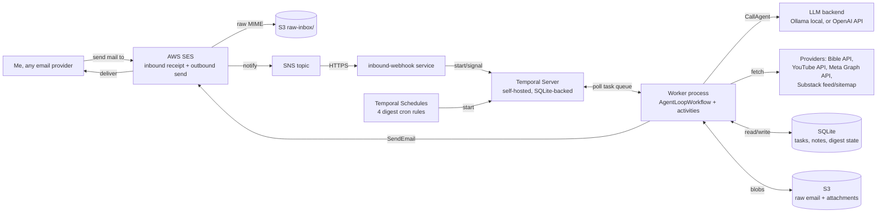

# super-email — Design

Personal self-hosted backend, in Go, that turns email into an agent
you talk to over a thread. Built to practice Go, Temporal, and running
an LLM agent loop. No serverless (Lambda/EventBridge) — compute is one
long-running box (Temporal + worker via Docker Compose) on EC2;
Terraform manages that box plus S3 and SES, the only managed AWS
services in the design.

## 1. Goals

- Single user (me). No multi-tenant auth complexity.
- Trigger everything by emailing myself (or a dedicated inbox) from any
  provider — Gmail, Outlook, iCloud, whatever.
- Requests aren't fixed commands: an LLM agent reads each email and
  decides what to do — ask a clarifying question, run the task, decide
  it's done, or redo it because the result wasn't good enough. Four
  digests (Bible reading, YouTube, Facebook/Instagram, Substack
  refresher) are just scheduled instances of that same agent loop.
- A notes/links inbox: capture, edit, delete — the agent's simplest task.
- Self-hosted compute, database, and orchestration (one EC2 box,
  Terraform-provisioned, otherwise mine to administer). Only mail
  send/receive (SES) and blob storage (S3) are managed AWS services —
  deliverability and spam filtering aren't worth self-hosting a mail
  transfer agent for, at personal scale.
- Optimize for "learn Temporal + agent-loop design" over "minimum
  services used" — but don't add a service without a job.

## 2. High-level architecture



Compute (Temporal + worker + inbound-webhook, via Docker Compose) runs
on one EC2 instance; S3 and SES are AWS-managed, everything else is
self-hosted on that box. Terraform (`terraform/`) provisions the EC2
instance, S3 bucket, and SES/SNS plumbing — it does not build or
deploy the Go app itself (see §9).

Every request — an inbound email or a scheduled digest tick — becomes
one `AgentLoopWorkflow` execution in Temporal. The workflow *is* the
agent loop: Temporal gives it durable state and signals for free, so
"wait days for the user's reply" and "retry until satisfied" aren't
special-cased plumbing, they're what the workflow does natively.

## 3. Mail edge

**Decision: AWS SES for send + inbound, self-hosted for everything
else.** SES solves deliverability, DKIM, and spam filtering — none of
that is worth self-hosting a mail transfer agent for, at personal
scale, when the whole point of this project is Temporal and the agent
loop, not mail server administration. Terraform manages SES alongside
the EC2 host and S3 bucket (`terraform/`), so mail plumbing and compute
are provisioned together.

Flow:
1. An SES receipt rule matches `me@inbox.mydomain.com` (and friendlier
   aliases), writes the raw MIME to S3 (`raw-inbox/`), and publishes a
   notification to an SNS topic.
2. The SNS topic has an HTTPS subscription pointed at
   `inbound-webhook`'s public URL (the one public endpoint in this
   design, reverse-proxied with TLS via Caddy). `inbound-webhook`:
   - Verifies the SNS message signature.
   - Fetches and parses the raw MIME from S3 using the notification's
     object key.
   - Verifies `From` is my allow-listed address — hard requirement,
     since the webhook URL is otherwise open to anyone who finds it.
     Anything else is dropped and logged, no reply sent.
   - Resolves a thread id (message-id/references headers, or a tag in
     the recipient address) and either starts a new `AgentLoopWorkflow`
     or sends it an `EmailReceived` signal if one is already running
     for that thread.
3. Outbound (agent replies + digests) goes through SES's send API
   (`SendEmail`/`SendRawEmail`), called from the `SendEmail` activity
   using the EC2 instance's IAM role — no static credentials to manage.

## 4. The agent loop

**Decision: one Temporal workflow type, two triggers.** An inbound
email and a digest cron tick both start the same `AgentLoopWorkflow`,
parameterized by an initial task description ("here's what the user's
email says" vs. "generate today's Bible reading digest"). This is what
makes digests "go through the agent loop" without a second workflow
type to maintain.

**Decision: pluggable LLM backend, Ollama for now.** `internal/agent`
defines a `Client` interface with two implementations — `ollama.go`
(local Ollama HTTP API, no key, no cost, good enough for testing loop
mechanics) and `openai.go` (OpenAI API key, for when response quality
matters more than iteration speed). Config picks the backend; start
and test everything against Ollama, switch to OpenAI per-deployment
or per-task later without touching the workflow.

Per iteration, the workflow runs a `CallAgent` activity (the
configured LLM backend) with the task description, full thread
history, and the last action's result, and gets back one of:

| Decision     | Workflow does |
|--------------|----------------|
| `ask_user`   | `SendEmail` activity with the agent's question, then block on the `EmailReceived` signal (or a timeout timer — see below) |
| `execute`    | `RunTaskAction` activity — dispatches to the concrete action (notes CRUD, or a digest provider fetch) — then loops back to `CallAgent` with the result |
| `rework`     | same as `execute`, but the agent's prompt includes why the last result wasn't good enough (its own prior critique) |
| `finish`     | `SendEmail` activity with the final result/summary, workflow completes |

Safety caps, since this loop is otherwise unbounded:
- Max iterations per workflow run (config, default e.g. 10) — on
  hitting it, force a `finish` that tells me it's stuck, so a bug in
  the agent's judgment can't loop forever burning LLM calls.
- Timeout on `ask_user`'s wait (config, default e.g. 3 days) — no
  reply means close the task, saving whatever's known as a note.
  Never silently drop what I sent, even if the agent couldn't finish
  it.
- `workflow.NewContinueAsNewError` once thread history grows large,
  to keep workflow history size bounded — carries forward a summary,
  not the full transcript.

This replaces the old idea of a subject-line command grammar
(`note:`, `note edit: <id>`, ...) entirely: there is no fixed syntax,
the agent reads intent from plain English. "Capture everything, never
silently fail" is still the fallback goal — if the agent can't
determine an actionable task, `execute` becomes "save this as a note."

**Building the loop before the tasks**: `RunTaskAction` is a
dispatch table keyed by command name (`create_note`, `send_digest`,
...); until real actions exist, it has one entry — a stub that logs
the exact command + parameters the agent chose and returns a canned
result. That's enough to drive and inspect the full
ask/execute/finish/rework cycle (via Temporal's CLI/UI) before any
task logic or even the mail edge exists — see section 11.

## 5. Storage model

**Decision: SQLite for structured state (for now), S3 for blobs.**
Single writer (the worker process), personal scale — SQLite is one
file, no server to run, no credentials to manage, and still beats
hand-rolled read-modify-write JSON. S3 (Terraform-managed, one bucket)
holds the one thing that's genuinely a blob: raw MIME + attachments.
The EC2 instance role has read/write IAM permissions on the bucket —
no static credentials, same as SES.

```
SQLite (app.db)
  tasks            (id, thread_id, status, iteration_count, created_at, ...)
  task_events      (task_id, role: user|agent|system, content, created_at)  -- thread history
  notes            (id, type: note|link, content, url, tags, created_at)
  digest_state     (source: bible|youtube|social|substack, state json)     -- reading-plan day, seen-post ids, etc.

S3 (one bucket, prefix-partitioned)
  raw-inbox/<message-id>      -- original raw MIME from SES, 30d lifecycle expiry
  attachments/<message-id>/*  -- inbound attachments, if any, kept indefinitely
```

Schema applied on startup (`CREATE TABLE IF NOT EXISTS`, embedded
`schema.sql`) — no migration framework yet, not worth it at this size.

Temporal keeps its own persistence, separately, using its built-in
SQLite store (fine for single-node/solo use) — two SQLite files, not
one, since Temporal owns its own schema. If SQLite's single-writer
model ever becomes a bottleneck (concurrent workers, real multi-user
load), the swap target is Postgres — that's why `internal/store` stays
a plain repository interface, not raw SQL calls scattered around.

## 6. Digest pipelines

Each digest is a Temporal Schedule that starts an `AgentLoopWorkflow`
with a fixed initial task ("generate and send today's <X> digest").
The agent's `execute` step calls the matching provider client under
`internal/providers`, then judges the result before sending (that's
the `rework` path earning its keep here — e.g. a YouTube fetch that
came back empty gets retried or escalated instead of mailing nothing).

- **Bible read** — `internal/providers/bible`, e.g. bible-api.com
  (free, no key). Progress tracked in `digest_state` (source=`bible`):
  sequential reading-plan day counter.
- **YouTube digest** — YouTube Data API v3, `playlistItems.list` on
  each subscribed channel's uploads playlist (channel list is config,
  not auto-subscribed — avoids needing OAuth on my personal account).
  Quota: `playlistItems.list` is cheap, avoid `search.list`.
- **Facebook/Instagram digest** — Meta Graph API. Highest-friction
  integration: needs a Meta developer app, a long-lived token that
  must be refreshed out-of-band (no fully-automatable refresh without
  a login flow), and Instagram increasingly requires a
  Business/Creator account linked to a Page. Treat as best-effort; the
  agent's `ask_user` path is a natural place to surface "token expired,
  go refresh it" instead of failing silently.
- **Substack refresher** — the RSS feed (`<pub>.substack.com/feed`)
  alone only carries recent items. Use it to seed known posts, and the
  sitemap (`<pub>.substack.com/sitemap.xml`) or archive page to
  discover the back-catalog once; resurface one not-recently-sent post
  per run, tracked in `digest_state` (source=`substack`).

## 7. Notes/links subsystem

No HTTP surface for me to use, period — email (through the agent) is
the only interface. Listing/searching notes, if wanted later, means
querying the SQLite file directly (`sqlite3` CLI) — no API Gateway, no
public endpoint, keeping the attack surface at "an inbox," not "an
inbox plus a website."

## 8. Go project layout

```
/cmd
  worker/              main.go — Temporal worker: registers AgentLoopWorkflow + all activities
  inbound-webhook/      main.go — HTTP server; verifies + starts/signals workflows
  bootstrap/            main.go — one-shot: creates/updates the 4 Temporal Schedules
/internal
  agent/                prompt construction, decision parsing; client.go
                        (interface + backend selection), ollama.go, openai.go
  workflow/              AgentLoopWorkflow + activity implementations
  mail/                  inbound webhook payload parsing, outbound send client
  store/                 SQLite repos (TaskStore, NoteStore, DigestStateStore),
                        embedded schema.sql, + S3 client
  providers/
    bible/
    youtube/
    meta/
    substack/
  model/                 Task, TaskEvent, Note, AgentDecision types
  config/                env var loading (.env for local, real env vars in deploy)
/deploy
  docker-compose.yml     temporal (SQLite persistence), temporal-ui,
                          inbound-webhook, worker
```

## 9. Infra & security notes

- **Secrets/config**: env vars (`.env` locally, injected by the deploy
  host otherwise) — allow-listed sender address, LLM backend choice +
  OpenAI API key (only needed for that backend — the local Ollama
  backend needs no secret), YouTube API key + channel IDs, Meta token,
  Substack publication list. No SES/S3 credentials to manage — the EC2
  instance role grants both via IAM. SQLite needs none either — it's
  just files on disk.
- **Network exposure**: only `inbound-webhook` needs a public endpoint
  (reverse-proxied, TLS via Caddy/Let's Encrypt) — Temporal, the
  worker, and SQLite stay on the box's internal network. SES delivers
  to that endpoint via an SNS HTTPS subscription (§3), not a public
  API Gateway.
- **Abuse guard**: SNS signature verification first, then
  `From`-allow-list check, before any workflow starts. Everything else
  is dropped, not bounced (don't confirm the address exists to a
  spammer).
- **Observability**: structured logs via `log/slog`; Temporal's own UI
  gives workflow-level visibility (stuck tasks, failed activities,
  retry history) for free — no separate alerting system needed at this
  scale, revisit if that stops being enough.
- **Deployment**: two layers. Terraform (`terraform/`) provisions the
  EC2 instance, S3 bucket, and SES/SNS plumbing — infra only, it
  doesn't build or push the Go app. On top of that, Docker Compose is
  the app deploy: ssh onto the instance, `docker compose up -d`
  (`deploy/docker-compose.yml`), same as it would be on a hand-made VPS
  or home server. Backups: copy the SQLite files (app data + Temporal's
  own) on a cron; S3 already has its own versioning/lifecycle rules
  (`terraform/modules/s3-data`).

## 10. Open questions / deferred

- Multi-instance worker scaling — not needed at personal scale, but
  Temporal's task-queue model means adding worker replicas later is
  just running more of the same container.
- Meta token refresh automation — likely stays manual (calendar
  reminder, or the agent's `ask_user` nag) unless a clean unattended
  refresh flow exists.
- Whether `task_events` needs its own retention/pruning once history
  gets long, independent of Temporal's own workflow-history size cap.
- SQLite → Postgres migration if concurrent-writer load ever needs it
  (section 5) — `internal/store` stays an interface for this reason.

## 11. Suggested build order

1. Docker Compose bootstrap: Temporal (SQLite persistence) + Temporal
   UI (S3 wiring waits until something needs blob storage — it's a
   managed service, not a compose container). Prove the Temporal
   server is reachable before writing any workflow.
2. `internal/agent` (Ollama backend first, OpenAI backend behind the
   same interface) + `AgentLoopWorkflow`
   with a **stub** `RunTaskAction` (logs command + params, returns a
   canned result) and a **stub** `SendEmail` (logs to stdout instead
   of sending) — no mail edge, no notes, no digests yet. Drive it with
   Temporal's own CLI: `temporal workflow start` with a task
   description, `temporal workflow signal` to simulate a reply,
   `temporal workflow show`/the Temporal UI to read back the decision
   trail. This is the point to validate ask/execute/finish/rework
   actually behaves before building anything real on top of it.
3. `internal/mail` (webhook parsing + send client) +
   `cmd/inbound-webhook`, swapped in for the stub `SendEmail` and as a
   second way to start/signal workflows (real email instead of the
   Temporal CLI) — proves the mail-in → Temporal → mail-out path.
4. Notes CRUD as the first real `RunTaskAction` entry, replacing the
   stub for that command.
5. One digest end-to-end (Bible) as a Temporal Schedule hitting the
   same `AgentLoopWorkflow`, then repeat for YouTube, Substack, Meta in
   roughly that order of API friction.
