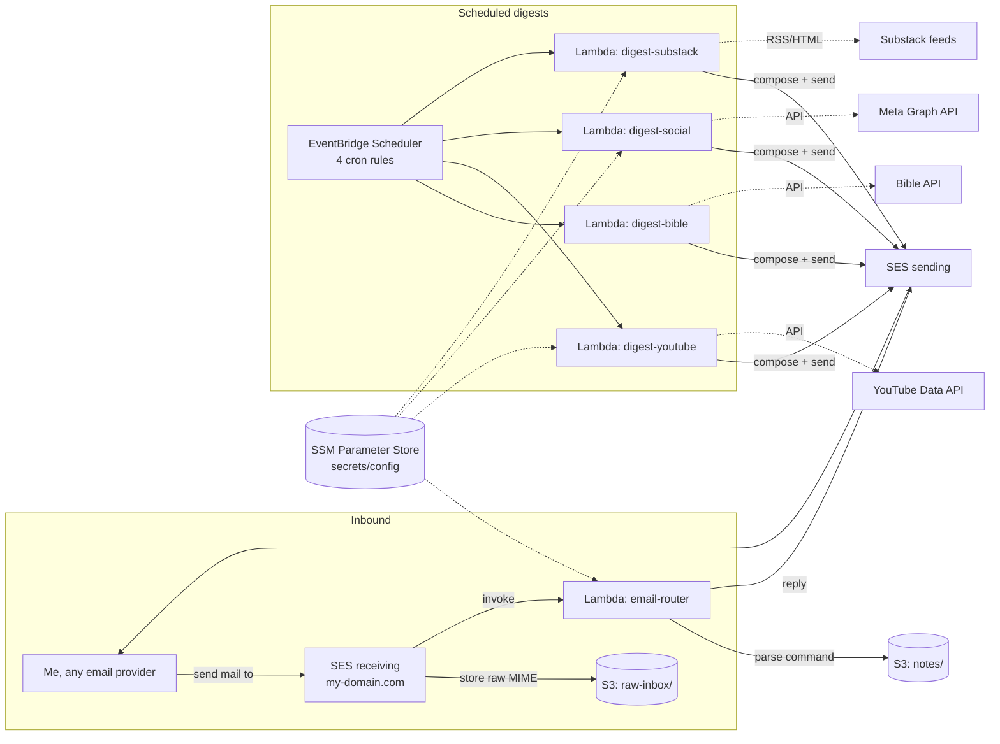

# super-email — Design

Personal serverless backend, in Go, that turns email into a command
interface for digests and a notes/links inbox. Built to practice Go:
Lambda handlers, S3, EventBridge, and Terraform.

## 1. Goals

- Single user (me). No multi-tenant auth complexity.
- Trigger everything by emailing myself (or a dedicated inbox) from any
  provider — Gmail, Outlook, iCloud, whatever.
- Four scheduled digests: Bible reading, YouTube, Facebook/Instagram,
  Substack refresher.
- A notes/links inbox: capture, edit, delete.
- Everything storable in S3. Infra fully in Terraform. Lambdas deploy as
  a Go binary zipped and uploaded directly — no Docker, no container
  registry.
- No public HTTP surface at all — email in, email out, nothing to
  provision an API Gateway for.
- Optimize for "learn Go idioms" over "minimum services used" — but
  don't add a service without a job.

## 2. High-level architecture



Every Lambda is its own `cmd/` binary, deployed independently as a zip
package. No shared "fat" function, no API Gateway, no public endpoint —
the only way in or out is email.

## 3. Inbound email

**Decision: AWS SES email receiving on a domain I own, not IMAP
polling of a Gmail/Outlook inbox.**

Rationale: SES receiving is the AWS-native path — it can invoke a
Lambda directly (or drop to S3 and fire an S3 event), needs no stored
IMAP/OAuth credentials, and is the whole reason to reach for SES in a
"practice AWS" project. The tradeoff is I need a domain with MX records
pointed at SES (any cheap domain works; a subdomain like
`inbox.mydomain.com` is enough — I don't need to move my main mail
there). *I* still send from Gmail/Outlook/whatever; only the receiving
address lives on SES.

Flow:
1. SES receipt rule on `me@inbox.mydomain.com` (and `note@…` as a
   friendlier alias — same rule, routing by recipient).
2. Rule action: store raw MIME in `s3://<bucket>/raw-inbox/<message-id>`,
   then invoke `email-router` Lambda with the S3 location (SES's
   Lambda action gives the mail object in the event, avoiding a second
   S3-trigger hop).
3. `email-router`:
   - Verifies `From` is my allow-listed address (hard requirement —
     SES receiving is otherwise open to anyone who knows the address;
     spam/abuse must be rejected before any processing). Anything else
     is dropped and logged, no reply sent.
   - Parses MIME (Go: `net/mail` + `mime/multipart`) — subject, plain
     text/HTML body, links found in the body.
   - Routes by command grammar to the notes handler.
   - Sends a reply via SES (confirmation, or error) to the original
     sender.

Outbound (digests + replies) uses the same SES identity, sending
domain verified + DKIM configured via Terraform (`aws_ses_domain_identity`,
`aws_ses_domain_dkim`).

## 4. Storage model

**Decision: S3 only for v1, no DynamoDB.** Single writer, personal
scale, and it keeps the Terraform/IAM surface small. Layout:

```
s3://super-email-data/
  raw-inbox/<message-id>.eml          # raw MIME, TTL'd via lifecycle rule (30d)
  notes/
    items/<id>.json                   # {id, type: note|link, content, url?, tags, created_at}
    index.json                        # [{id, type, summary, created_at}, ...]
  digest-state/
    bible-progress.json               # {day: n} — resume point for reading plan
    substack-seen.json                # {slug: [seen post ids]} — avoid repeats
```

Each write (create/edit/delete) rewrites the affected item object *and*
`notes/index.json` in the same handler call — not a queue, not
eventual consistency. S3 offers no multi-object transactions, so
concurrent writers could race, but there's only one writer (me, via
email) so this is fine. `index.json` is small enough to read-modify-write
whole; if it gets unwieldy, revisit.

IDs: ULID per note (sortable, no clock sync issues, no slug collisions
to worry about).

## 5. Email command grammar

Subject-line driven, case-insensitive prefix match, body is the payload:

| Subject prefix              | Action                                   | Body                     |
|------------------------------|-------------------------------------------|--------------------------|
| `note: <anything>`           | new note; if body/subject is a bare URL, `type=link` | text or nothing |
| `note edit: <id>`            | replace content                          | new text                 |
| `note delete: <id>`          | delete note                              | (ignored)                |
| *(no recognized prefix)*     | default: treat whole mail as a new note  | subject+body captured    |

Reply always confirms: `"Saved note <id>"` or an error explaining the
parse failure. This makes the router forgiving — an unrecognized
command becomes a note instead of silently failing, since "capture
everything" is the fallback goal of a send-yourself-stuff inbox.

## 6. Digest pipelines

One Lambda per digest, separate EventBridge Scheduler cron rules,
sharing an `internal/digest` package for the "fetch → render text/HTML
→ send via SES" skeleton. Per-source notes:

- **Bible read** — `internal/providers/bible`, e.g. bible-api.com (free,
  no key). State in `digest-state/bible-progress.json` tracks a
  sequential reading-plan day counter; digest = today's reading + link.
- **YouTube digest** — YouTube Data API v3, `playlistItems.list` on each
  subscribed channel's uploads playlist (channel list is config, not
  auto-subscribed — avoids needing OAuth on my personal account; an API
  key + a hardcoded channel-ID list is enough). Quota cost noted in
  README once implemented (10k units/day free tier; `playlistItems.list`
  is cheap, `search.list` is not — avoid the latter).
- **Facebook/Instagram digest** — Meta Graph API. Flagged as the
  highest-friction integration: needs a Meta developer app, a
  long-lived (60-day) user/page token that must be refreshed
  out-of-band (no fully-automatable refresh without a login flow), and
  Instagram's API increasingly requires a Business/Creator account
  linked to a Facebook Page. Treat as best-effort; if token refresh
  becomes too annoying, fall back to whatever public RSS bridge is
  available at implementation time, or drop Instagram and keep just
  Facebook Page posts (Pages have simpler long-lived tokens).
- **Substack refresher** — "old posts" means the RSS feed
  (`<pub>.substack.com/feed`) alone isn't enough — it only carries
  recent items. Use the feed to seed known posts, and Substack's
  sitemap (`<pub>.substack.com/sitemap.xml`) or archive page to
  discover the full back-catalog once, then randomly resurface one
  not-recently-sent post per run, tracked in
  `digest-state/substack-seen.json`.

## 7. Notes/links subsystem

No HTTP surface, period — email is the only interface (capture via
plain send, edit/delete via the `note edit:`/`note delete:` commands).
Listing/searching notes, if wanted later, means grepping S3
directly (console or CLI) — no API Gateway, no Lambda, to keep the
whole project's attack surface at "an inbox," not "an inbox plus a
website."

## 8. Go project layout

```
/cmd
  email-router/       main.go — SES-invoked entrypoint
  digest-bible/
  digest-youtube/
  digest-social/       (Facebook + Instagram together)
  digest-substack/
/internal
  email/               MIME parsing, SES send helpers, command grammar parser
  store/                S3-backed repositories: NoteStore, DigestStateStore
  digest/               shared "fetch → render → send" skeleton + email templates
  providers/
    bible/
    youtube/
    meta/
    substack/
  model/                Note, Digest types
  config/               env var + SSM parameter loading
/terraform
  modules/
    lambda-go/          generic module: go build → zip → Lambda + IAM role
    ses-inbound/          domain identity, DKIM, receipt rule set, MAIL FROM
    s3-data/
    scheduler/            EventBridge Scheduler rules → Lambda targets
  envs/
    prod/
```

Each Lambda is `GOOS=linux GOARCH=arm64 CGO_ENABLED=0 go build` into a
`bootstrap` binary, zipped, and uploaded straight to Lambda — no
Dockerfile, no ECR repo, no registry login. Terraform runs the build
itself (`terraform/modules/lambda-go`).

## 9. Infra & security notes

- **Secrets/config**: SSM Parameter Store (`SecureString` for tokens),
  not Secrets Manager — free, and rotation isn't automatable here
  anyway (Meta tokens especially need manual refresh). Params:
  allow-listed sender address, YouTube API key + channel IDs, Meta
  token, Substack publication list.
- **IAM**: one role per Lambda, least privilege — e.g. `email-router`
  gets `s3:GetObject` on `raw-inbox/*` + `s3:PutObject/GetObject` on
  `notes/*`, `ses:SendEmail`; `digest-youtube` gets no notes access at
  all, just `digest-state/*` + `ses:SendEmail`.
- **Abuse guard**: SES receipt rule scoped to specific recipient
  addresses only; router double-checks `From` against the allow-list
  before doing anything. Everything else is dropped, not bounced (don't
  confirm the address exists to a spammer).
- **Observability**: structured logs via `log/slog` (JSON handler) —
  Lambda ships these to CloudWatch automatically. A CloudWatch alarm on
  any Lambda's `Errors` metric → SNS → email, so failures surface
  without polling logs.
- **Deployment**: `provided.al2023` custom runtime, one static
  `bootstrap` binary per function, zipped and uploaded by Terraform
  (`aws_lambda_function` + `archive_file`, `terraform/modules/lambda-go`)
  — no Docker, no ECR, no image builds. Cross-compiling for
  `linux/arm64` from any dev machine is just a Go env var, so this also
  sidesteps any host-architecture build concerns.

## 10. Open questions / deferred

- DynamoDB migration path if S3 index-file writes ever race or the
  index grows past comfortable read-modify-write size (not expected at
  personal scale, but the repository interface in `internal/store`
  should stay swappable).
- Meta token refresh automation — likely stays manual (calendar
  reminder) unless a clean unattended refresh flow exists.

## 11. Suggested build order

1. Terraform bootstrap: S3 bucket, SES domain identity + DKIM (this has
   DNS propagation lag — start it first).
2. `email-router` + SES receipt rule + `store` package (notes S3
   repo) + command grammar. Prove the full inbound loop with the "note"
   fallback first.
3. One digest end-to-end (Bible — simplest API, no auth) to prove the
   EventBridge → Lambda → SES send path, then repeat for YouTube,
   Substack, Meta in roughly that order of API friction.
